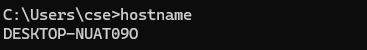
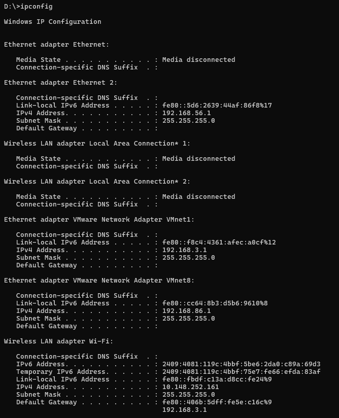
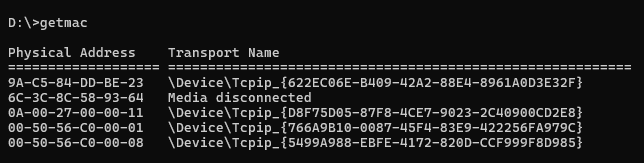
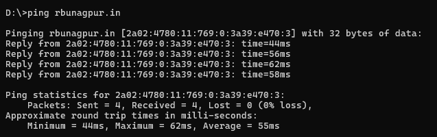
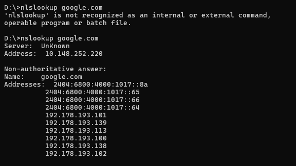
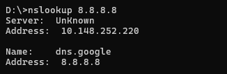
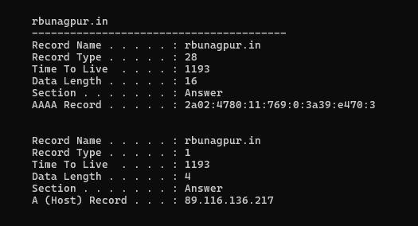
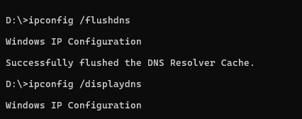

**Computer Network lab**

**Date: 27-08-26**

**Name: Ayush Ravindra Patil**

**Roll No.: C22**

**<u>Host Commands:</u>**

1.  C:/hostname

>  style="width:3.82345in;height:0.52091in" />

2.  D:/ipconfig

>  style="width:4.54651in;height:5.60833in" />

3.  D:\\getmac

>  style="width:5.84375in;height:1.47874in" />

4.  D:\\ping rbunagpur.in

>  style="width:5.83333in;height:1.83156in" />

5.  D:/\>nslookup google.com

>  style="width:6.00084in;height:3.37547in" />

6.  D:\\nslookup 8.8.8.8

>  style="width:3.39631in;height:1.11474in" />

7.  D:\\ipconfig /displaydns

>  style="width:5.46951in;height:2.95875in" />

8.  D:\\ipconfig /flushdns

>  style="width:4.43812in;height:1.75024in" />
