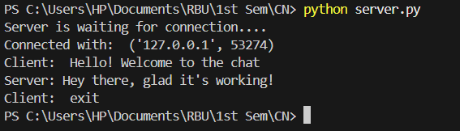
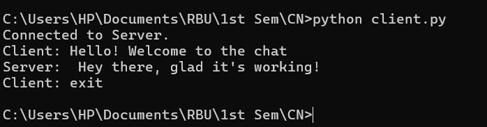

<div align="right">
  <a href="https://run-python.pages.dev/" target="_blank">
    
  </a>
</div>

## Computer Network Lab

**Name: Ayush Ravindra Patil**

**Roll No.: 22**

**Section: C (Batch 2)**

**Date: 10-09-26**

**Practical: 3**

### Aim: Implementation of Bit stuffing and Character stuffing framing techniques.

--

## **1] Bit Stuffing**

**Code:**

```python
def bit_stuffing(data):

    flag = '01111110'

    pattern = '111111'

    stuffed_bit='0'

    stuffed_data = ''

    count=0

    for bit in data:

        if bit=='1':

            count_ones += 1

            stuffed_data += bit

        else:

            count_ones = 0

            stuffed_data += bit

        if count_ones == 5:

            stuffed_data += stuffed_bit

            count_ones = 0

        return flag + stuffed_data + flag

data = '01111011111101110'

print(f'Original data: {data}')

print(f'stuffed bit: {bit_stuffing(data)}')
```

**Output:**




---


## **2] Character Stuffing**

**Code:**

```python
def character_stuffing(data):

    flag = 'F'

    esc = 'E'

    stuffed_data = ''

    for char in data:

        if char == flag or char == esc:

            stuffed_data += esc

        stuffed_data += char

    return flag + stuffed_data + flag

data=input("Enter character frame: ")

print(f'Original Data: {data}')

print(f'Stuffed Data: {character_stuffing(data)}')
```

**Output:**




<details>
  <summary><b>✨ Click here to run this code interactively</b></summary>
  <br>
  You don't need to install Python on your computer to test this assignment! 
  
  I have built a custom Cloudflare web app that lets you edit the code, enter your own binary inputs, and see the output live in your browser.
  
  👉 <a href="https://run-python.pages.dev/"><b>Open the Live Web Compiler</b></a>
</details>

