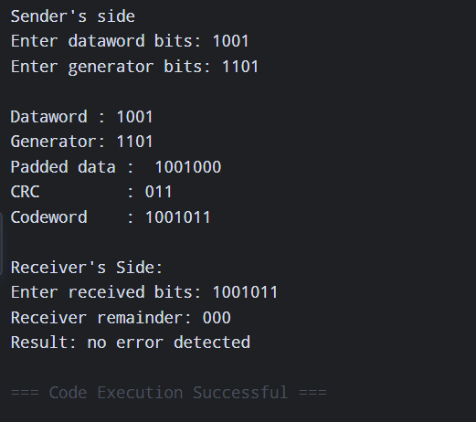
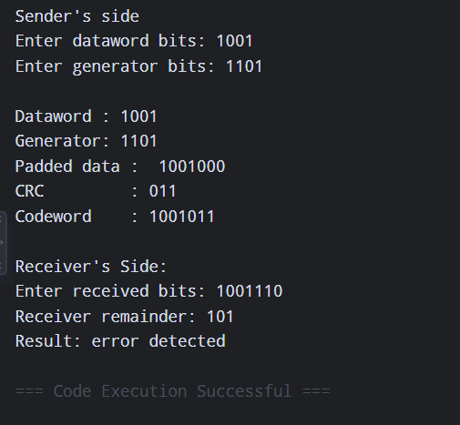

<div align="right">
  <a href="https://run-python.pages.dev/" target="_blank">
    
  </a>
</div>

## Computer Network Lab 

**Name: Ayush Ravindra Patil**

**Roll No.: 22**

**Section: C (Batch 2)**

**Date: 10-09-26**

**Practical: 4**

### Aim: Implementation of Cyclic Redundancy Check (CRC) for error detection.

**1\] Algorithm:**

> **Step 1) Start**
>
> **Step 2) Take input dataword and polynomial**
>
> **Step 3) Convert the polynomial into bits and calculate the number of redundancy bits (zeros).**
>
> **Step 4) Concatenate the dataword and the redundancy bits (zeros) to create the padded dataword.**
>
> **Step 5) Perform Modulo-2 Division (also known as XOR division) on the sender side with the padded dataword and the divisor.**
>
> **Step 6) Concatenate the resulting remainder at the LSB (Least Significant Bit) with the original dataword to form the codeword.**
>
> **Step 7) Perform Modulo-2 Division (XOR division) on the receiver side with the received codeword and the divisor.**
>
> **Step 8) If the remainder is 0, then the data is accepted; otherwise, discard the operation (error detected).**
>
> **Step 9) Stop**

**2\] Code:**

```python
def xor_division(bits, generator):
    data = list(bits)
    gen = list(generator)
    for i in range(len(data) - len(gen) + 1):
        if data[i] == '1':
            for j in range(len(gen)):
                data[i + j] = str(int(data[i + j]) ^ int(gen[j]))
    return ''.join(data[-(len(gen) - 1):])

# _-_-_ Sender _-_-_
print("Sender's Side: ")
dataword = input("Enter dataword bits: ")    
generator = input("Enter generator bits: ")
print("\nDataword :", dataword)
print("Generator:", generator)

zeros = '0' * (len(generator) - 1)
padded_data = dataword + zeros
print("Padded data : ", padded_data)

crc = xor_division(padded_data, generator)
print("CRC         :", crc)

codeword = dataword + crc
print('Codeword    :', codeword)

# _-_-_ Receiver _-_-_
print("\nReceiver's Side:")
received = input("Enter received bits: ")
receiver_remainder = xor_division(received, generator)
print("Receiver remainder:", receiver_remainder)

if receiver_remainder == '0' * (len(generator) - 1):
    print("Result: No Error Detected")
else:
    print("Result: Error Detected")
```

**3\] Output:**

- **If Correct:**

> 

- **If Incorrect:**

> 


<details>
  <summary><b>✨ Click here to run this code interactively</b></summary>
  <br>
  You don't need to install Python on your computer to test this assignment! 
  
  I have built a custom Cloudflare web app that lets you edit the code, enter your own binary inputs, and see the output live in your browser.
  
  👉 <a href="https://run-python.pages.dev/"><b>Open the Live Web Compiler</b></a>
</details>
